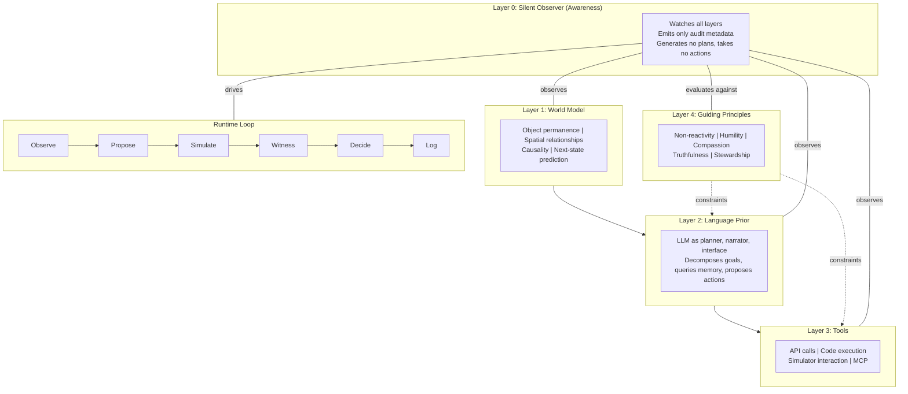

# Project Witness

**Separating Awareness from Thought in AI Agent Architecture**

## Thesis

Current AI agents interleave reasoning and action in a single process. When they reflect, the same process that made the error evaluates the error. Project Witness introduces a structurally separate Silent Observer that watches reasoning happen and decides whether the system is in a state where action is appropriate. The observer generates no plans and takes no actions; it emits only structured audit metadata.

## Architecture

The system is a five-layer intelligence stack. The observer sits at Layer 0, watching all other layers. It never proposes, never plans, never executes.



## Results

### Baseline (no observer)

Models answer every question. Confidence is self-reported.

| Model | Accuracy | Confidence | Overconfidence Gap |
|-------|----------|------------|-------------------|
| Gemini 2.5 Flash | 70.5% | 96.4% | +27% |
| Qwen2.5-72B | 43.6% | 94.1% | +54% |

Both models are dramatically overconfident. Qwen2.5-72B reports 94% confidence while scoring 44% accuracy.

### Observer-gated

The observer allows the model to answer only when confidence, reversibility, and principle checks pass. Selective accuracy measures accuracy on approved answers only.

| Model | Baseline Accuracy | Selective Accuracy | Lift | Coverage | Calibration Error |
|-------|-------------------|-------------------|------|----------|-------------------|
| Gemini 2.5 Flash | 70.5% | 82.3% | +16.7% | 62.5% | 0.265 -> 0.214 |
| Qwen2.5-72B | 43.6% | 44.5% | +2.1% | 50.0% | 0.505 -> 0.360 |

Gemini gains 16.7 percentage points of accuracy when the observer gates its output. The system knows what it doesn't know.

### Per-category breakdown (baseline, both models combined)

| Category | Accuracy | Best Finding |
|----------|----------|-------------|
| Basic Physics | 69.7% | Observer +7.3% selective lift |
| Temporal Causality | 67.6% | Observer +8.0% selective lift |
| Object Permanence | 63.3% | Observer +7.0% selective lift |
| Affordances | 27.6% | No existing benchmark tests this |

Affordance reasoning (what can be done with an object, what could go wrong) is catastrophically weak across all models. No published benchmark measures this systematically.

## Gate Decisions

The observer chooses exactly one of five outputs for every proposed action:

| Gate | Meaning |
|------|---------|
| **ACT** | Confidence is high, action is reversible, no principle flags. Proceed. |
| **ASK_HUMAN** | Confidence is below threshold. Escalate for clarification before acting. |
| **WAIT** | Conditions are ambiguous. Do nothing now, reassess on the next cycle. |
| **GATHER_EVIDENCE** | Belief conflicts detected. Seek more information before deciding. |
| **REFUSE** | Action violates a hard principle or poses unacceptable risk. Block it. |

Inaction is first-class. The system has no bias toward doing something over doing nothing.

## Why This Matters

Project Witness is not a "better agent framework." It is a structurally different one. Here is how it compares:

| Approach | How reflection works | Project Witness difference |
|----------|---------------------|--------------------------|
| **Constitutional AI** (Anthropic) | Values trained into model weights at training time | Values are external, applied at runtime by a separate process |
| **Reflexion / Self-Refine** | Same model critiques its own output | Observer is a structurally separate process that never generated the output |
| **ReAct loops** | Interleave reasoning and action in one process | Observation is completely separated from action |
| **Overthinking paradox** (DeepMind) | More reasoning can destroy accuracy past 2-3x baseline compute | Observer knows when to stop thinking and gate action |

The key insight: when the process that made the error evaluates the error, you get ego examining ego. Separating the observer from the reasoner breaks that loop.

## Non-goals

- **NOT** training a frontier model
- **NOT** building a humanoid robot
- **NOT** claiming consciousness or AGI
- **NOT** encoding religion or metaphysics into model weights
- **NOT** building a consumer chatbot with spiritual branding
- **ARE** testing whether separating awareness from thought produces measurably better agent outcomes

## Tech Stack

| Component | Tool |
|-----------|------|
| Primary VLM + judge | Gemini 2.5 Flash (free tier) |
| Secondary model | Qwen2.5-72B-Instruct (HF Inference) |
| Structured storage | DuckDB |
| Schemas | Pydantic v2 |
| Demo | Gradio (local) |
| Visualization | Plotly |
| Orchestration | Makefile |

No Docker, no local GPU inference, no RunPod. Everything runs on a MacBook Pro M3 Pro with API calls to hosted models.

## Quick Start

```bash
git clone https://github.com/sterlingblood/project-witness.git
cd project-witness
make setup
source .venv/bin/activate

# Set API keys in .env
# GEMINI_API_KEY=your-key
# HF_TOKEN=your-token

make eval       # Run full evaluation pipeline
make cockpit    # Launch local Gradio dashboard
```

## Roadmap

| Version | Scope |
|---------|-------|
| **v0.1** (current) | Eval kit + observer + cockpit. Proves observer-gated accuracy beats baseline. |
| **v0.5** | AI2-THOR simulation integration. Observer tested in closed-loop interactive environments. |
| **v1.0** | Full architecture with all five observer checks, commitment memory, and operator cockpit as primary human interface. |

## The Pitch

I built Jasper's entire data platform from zero, processing 715M+ content generations. World models have a data problem that is 10x harder than text-based AI, and most research teams are solving it with duct tape. Project Witness demonstrates the evaluation infrastructure, data pipeline architecture, and metacognitive design patterns that let world-model products actually ship.

## License

MIT
